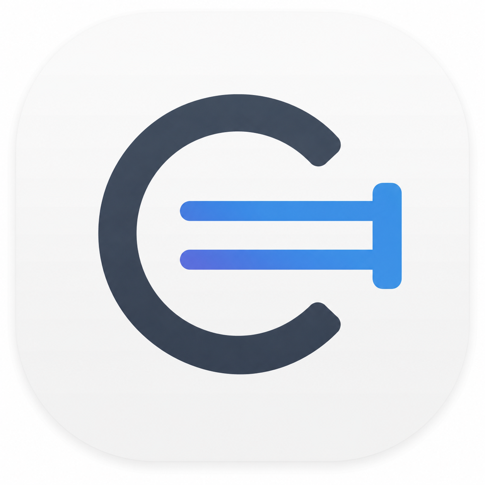

  

<h1 align="center">Conduit</h1>

  A private iOS workspace for keeping client deployments, ports, access details, and credentials organized on-device.

  
  
  
  

  

---

## What Conduit Is

Conduit is built for people who manage small client systems and need a clear, private place to remember what runs where.

Instead of spreading deployment details across notes, chats, spreadsheets, and memory, Conduit keeps the practical pieces together:

| Area | What it helps track |
| --- | --- |
| **Clients** | Projects, companies, or server groups |
| **Deployments** | Apps or systems attached to each client |
| **System Info** | Online/offline status, deployment URL, IP, location, and system port |
| **Database Config** | Database name, port, sensitive host/token value, and password |
| **Internal Routing** | Service names and ports used inside the deployment |
| **Admin Access** | Admin username and protected password |
| **Custom Options** | Extra text, URL, port, or password fields for stack-specific notes |

---

## Highlights

<table>
  <tr>
    <td width="50%">
      <h3>Private by Default</h3>
      
No account, backend, or sync requirement. Deployment records stay on the device.

    </td>
    <td width="50%">
      <h3>Credential Aware</h3>
      
Sensitive values are stored separately in the iOS Keychain and unlocked with Face ID, Touch ID, or passcode.

    </td>
  </tr>
  <tr>
    <td width="50%">
      <h3>Built for Real Deployments</h3>
      
Track URLs, ports, internal services, database details, and admin access without assuming one specific tech stack.

    </td>
    <td width="50%">
      <h3>Flexible Custom Fields</h3>
      
Add custom categories with text, URL, port, or password fields when a deployment needs something unique.

    </td>
  </tr>
</table>

---

## Preview

  
  
  

  

---

## Conduit Free

Conduit Free is designed to be useful without a paid upgrade.

<strong>Included in the free beta</strong>

| Feature | Included |
| --- | :---: |
| Local client and deployment tracking | Yes |
| Offline-first storage | Yes |
| Keychain-backed credentials | Yes |
| Biometric/passcode unlock | Yes |
| Internal routing and port tracking | Yes |
| Database and admin access sections | Yes |
| Custom text, URL, port, and password fields | Yes |
| In-app feedback email | Yes |
| Delete all local data option | Yes |

<strong>Current free limits</strong>

| Limit | Value |
| --- | --- |
| Clients | 4 |
| Deployments per client | 3 |
| Database config per deployment | 1 |
| Admin access section per deployment | 1 |
| Internal routing entries | Multiple |
| Custom options | Multiple |

<strong>Not included in Conduit Free</strong>

These are not part of the free beta:

- iCloud sync
- uptime monitoring
- Cloudflare or hosting-provider imports
- PDF or markdown infrastructure reports
- team sharing
- automated deployment checks

---

## Security Model

Conduit does not store passwords in the main app database.

General deployment records are stored locally with SwiftData. Passwords and sensitive token-like values are stored separately in the iOS Keychain using device-bound protection.

When a client or deployment is deleted, Conduit also removes its related saved credentials from the device.

---

## Beta Status

Conduit is currently prepared for closed beta testing.

The beta focus is simple:

- confirm the app is easy to understand on first launch
- test adding and editing real deployment information
- verify credential unlock and save flows
- check that deletion and local reset flows behave clearly
- collect feedback before adding larger paid features

---

## From ArkSoft

Conduit is made by ArkSoft as a focused utility for developers, freelancers, and small teams who want a calmer way to keep deployment details close at hand.

  

